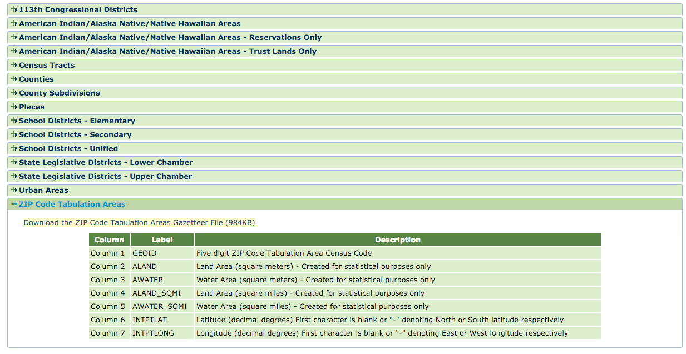
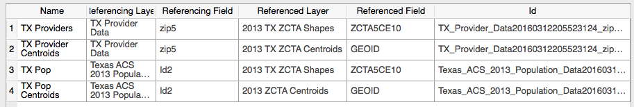

# Working with QGIS

## Intro

1. Download QGIS
1. Download Data
	1. GIS Data
		1. [2010 Census ZCTA Shapefiles](https://www.census.gov/geo/maps-data/data/cbf/cbf_zcta.html)
		2. [2013 Census ZCTA Gazetteer files](https://www.census.gov/geo/maps-data/data/gazetteer2013.html)
		3. [2013 Texas Tracts](http://www.census.gov/cgi-bin/geo/shapefiles/index.php)
	1. Non-GIS data
		1. [American Fact Finder, 2013, B01001 Table](http://factfinder.census.gov/faces/tableservices/jsf/pages/productview.xhtml?pid=ACS_13_5YR_B01001&prodType=table)
		1. [Physician patient demographics](https://www.cms.gov/Research-Statistics-Data-and-Systems/Statistics-Trends-and-Reports/Medicare-Provider-Charge-Data/Physician-and-Other-Supplier2013.html)

## Story Maps

1. [Esri Storymaps](http://storymaps.arcgis.com)
1. [mapstory.org](http://mapstory.org)

## Before you start

1. What are we doing?
1. ZIP Code vs. ZCTA
1. Using ZCTAs for Healthcare
	1. [On the use of ZIP codes and ZIP code tabulation areas (ZCTAs) for the spatial analysis of epidemiological data
](http://www.ncbi.nlm.nih.gov/pmc/articles/PMC1762013/)
	1. [Everything you wanted to know about zip code use in public health and were afraid to ask](http://www.wrenconference.org/WREN_2010_Documents/2010_presentations/SmorodinskyWREN2010.pdf)

## Downloading Census Data
1. Go to [American Fact Finder (US Census)](http://factfinder.census.gov/faces/nav/jsf/pages/searchresults.xhtml?refresh=t) 
1. In the search criteria, add the area of interest (Texas) and the Geography (5 Digit ZCTA)

1. In "Refine Your Search" search box, enter **B01001**, which is the *SEX BY AGE* table. Choose the 2013 year, since that's the year of the rest of our data.
	1. Unlike the *S* series tables, which list percentages by category, the *B* tables have raw counts. We need raw counts to get per-capita calculations.
1. Click on show table tools (under Table View tab) and click on "Transpose Rows/Columns"
	1. We want to create a document where each row is a unique ZCTA, the default view is each column is a unique ZCTA, not compatible with QGIS joins.
	

1. Download the table and then cut out the first line
	1. We want to get rid of the first line because it contains technical descriptions of the fields, while what we want is human-readable details we'll use to join the table later

## Downloading Census Shapes

1. Download the 2013 ZCTA shapes, since that's the year of our data

2. Download 2013 Gazetteer file, which gives us the centroids for each ZCTA in our shape file. We'll use this for heatmaps.

## Put together the source data for the story map

The basic idea is that we want to take the shape files, combine them with BOTH the census data, and aggregated provider data, and calculate population-adjusted values, which we can then use to see the actual trends, not just population centers. We'll use the shape files to create choropleths (thematic map in which areas are shaded or patterned in proportion to the measurement of the statistical variable being displayed on the map), and we'll use the Gazetteer files to create heatmaps, hot spots visualizations of data on a map.

### Steps
1. Create a new project in QGIS (File > New)
1. Add our non-geospatial source data to the project, create a "Data" group, and drag our datasets in there
	1. It makes a lot of sense to filter-out non-Texas data from the NPI Aggregate table, since it's very large and takes a long time to load. You can do this in Excel or numbers.
	
		1. While you're at it, since the NPI Aggregate uses ZIP and ZIP+4, we want to standardize to ZIP5, since that's what ZCTAs reflect 
		
	1. We also want to aggregate the data for each ZIP into a single row, since we don't care about individual providers, we care only about the ZIP code aggregates.
	
	1. Export the aggregate table into a CSV
1. Add our geospatial source data to the project, create a "GIS" group and drag the geospatial datasets in there.
	1. import gazetteer data
	
	
	1. import ZCTA Data
	
	1. import Tract data
	
1. Use the Tract data to select those ZCTAs in Texas
	1. Enable ZCTA, Gazetteer and Tract layers
	
	1. Use QGIS' vector tools to do a selection of ZCTA centroids based on intersection with tracts
	
	and then
	
	5. Copy the selected ZCTAs, and Paste As > New Vector Layer
	
	
	
	1. Repeat same for ZCTA shapes.
	1. At the end of this process, this is what you should have:
	
	
1. Add our non-GIS datasets to the project, via File > Project Properties > Relations
	
	
	
	
	
1. Join the datasets to the shapes / centroids
	1. While the relations added a 1:many linkage between the shapes and the data files, we still need to join the data to the shapes to have it be accessible to us.
	
	
	
1. Export our shapes and centroids to ESRI Shapefiles, and upload them to ESRI Story Map to create a story map
	1. Export ZCTA Centroids into an "ESRI Shapefile" format, and zip up all the files into a single zip.
		1. Depending on the data, you may have to cut down the number of features you export to 1000, since that's a limitation of the ESRI Story Map product.
	2. Export ZCTA Shapes into an "ESRI Shapefile" format, and zip up all the files into a single zip.

## Next Steps

1. More data
2. More maps
3. More statistics
4. More stories